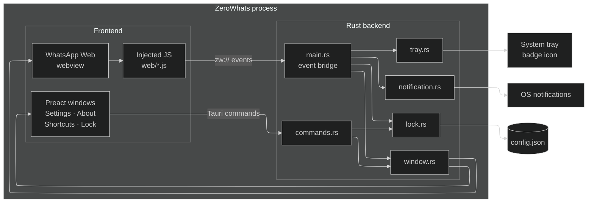
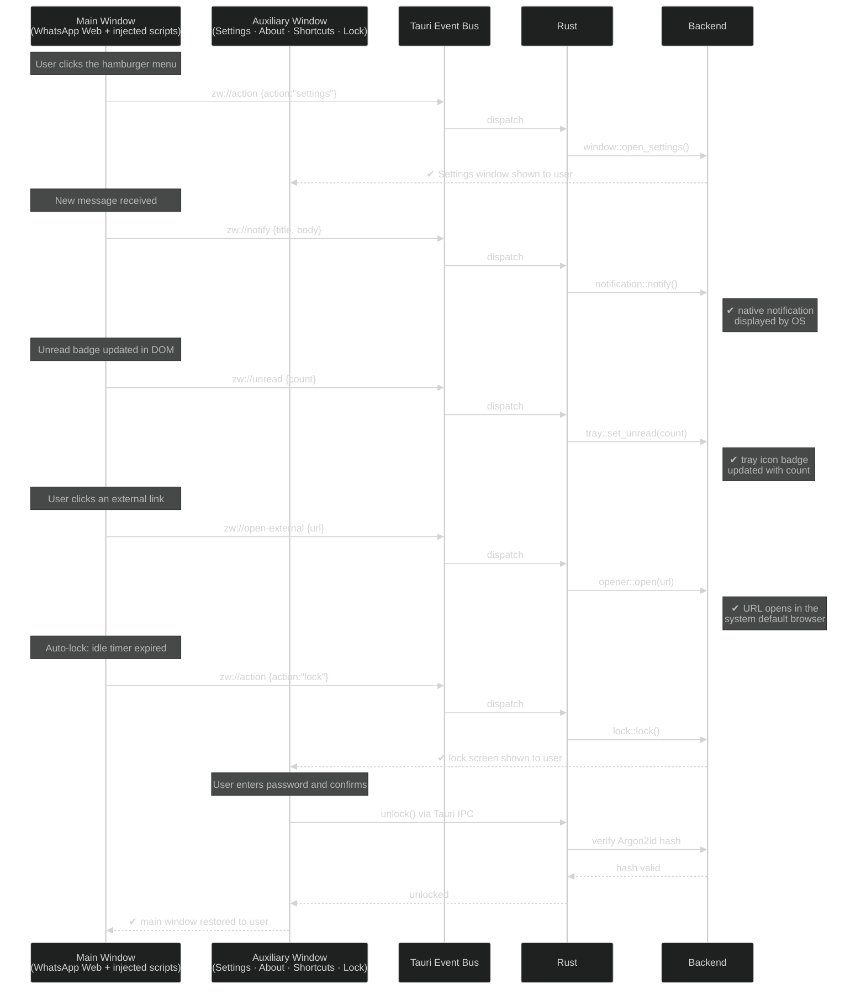

<div align="center">


# ZeroWhats

**Read this in other languages:** [Português (Brasil)](README.pt-BR.md)

**A privacy-first WhatsApp Web desktop client for Linux, macOS & Windows.**

Small, fast, native — built with [Tauri](https://tauri.app) + [Preact](https://preactjs.com). No Electron,
no telemetry, no bundled browser.

<sub>Native notifications · App lock with auto-lock · Tray unread counter · WhatsApp-only sandbox</sub>

<br />

[](LICENSE)


[](https://github.com/ZauJulio/ZeroWhats/releases)
[](CONTRIBUTING.md)

</div>

---

## Why ZeroWhats?

WhatsApp Web in a real desktop window, with the things the browser tab can't give
you — and nothing it shouldn't:

- 🔔 **Native OS notifications.** WhatsApp's web notifications are redirected to
  the system notification service. No browser permission prompts, and no MPRIS
  media-session pollution of your media keys.
- 🔒 **App lock.** Optional password (Argon2id), with **lock-on-close** and
  **lock-on-idle** (auto-lock after N minutes). Removing or replacing the
  password requires the current one, or a system-admin authentication (polkit
  on Linux, UAC on Windows, an admin prompt on macOS) — so a thief can't just
  strip the lock. Forgot it entirely? On Linux you reset via polkit; elsewhere
  ZeroWhats offers to log out and wipe local data. Settings stay inaccessible
  while the app is locked.
- 🔢 **Tray unread counter.** The unread total is drawn as a badge right on the
  tray icon — visible on GNOME/AppIndicator, macOS and Windows.
- 🖱️ **Tray menu.** Show, Preferences, Mute/Unmute (toggles label), a
  separator, then Lock (once a password is set) and Quit. Per-item icons
  render on KDE/macOS/Windows; GNOME's AppIndicator bridge doesn't support
  per-item menu icons, so there it's labels + separator only.
- 🛡️ **WhatsApp-only sandbox.** The app window will only ever navigate to
  WhatsApp; any other link opens in your real browser. Local UI runs under a
  strict CSP.
- 🎨 **Light / dark / system theme**, for both the app chrome and WhatsApp.
- ✍️ **Spell check.** Toggle it on and pick your dictionaries (English, Portuguese,
  Spanish, French, German, Italian…) in Settings → Advanced. Misspellings are
  underlined in the message box. On Linux this uses the system hunspell/enchant
  dictionaries — install the ones you need (see [Spell check dictionaries](#spell-check-dictionaries) below).
  On macOS and Windows, the OS spell checker is used automatically.
- 📋 **Clipboard paste that actually works.** Paste screenshots *and* files or
  images copied from your file manager straight into a chat — a workaround for a
  long-standing WebKitGTK limitation on Linux.
- 🖼️ **Stickers & emoji render correctly** on Linux by advertising a real WebKit
  (Safari) user-agent, so WhatsApp serves the WebKit-tested code path.
- 🪟 **Custom frameless window** with an in-page titlebar: maximize button,
  double-click-to-maximize, and edge/corner resize grips.
- 🪶 **Tiny & fast.** A size-optimized Rust binary and the system WebView — a
  fraction of an Electron app's footprint.

## Install

Grab the file for your platform from the [latest release](https://github.com/ZauJulio/ZeroWhats/releases):

| OS          | File                                   | Notes                                                             |
| ----------- | -------------------------------------- | ----------------------------------------------------------------- |
| **Linux**   | `.AppImage`                            | Portable — `chmod +x` and run.                                    |
| **Linux**   | `.deb` / `.rpm`                        | `sudo apt install ./ZeroWhats_*.deb` / `sudo dnf install ./*.rpm` |
| **Linux**   | Snap / AUR (`zerowhats-bin`)           | See [`release/`](release/).                                       |
| **Windows** | `.msi` / `-setup.exe`                  | Uses the built-in WebView2.                                       |
| **macOS**   | `.dmg`                                 | Universal builds for Apple Silicon & Intel.                       |

> **Linux note:** like every Tauri app, ZeroWhats uses the system **WebKitGTK**
> (`libwebkit2gtk-4.1`) and an AppIndicator tray. The `.deb`/`.rpm` declare these
> as dependencies; the `.AppImage` bundles most of them. A "zero-dependency"
> static binary isn't possible on Linux because the WebView is a system library —
> that's exactly why the binary stays so small. Windows (WebView2) and macOS
> (WKWebView) ship their WebView with the OS.

## Where is my data?

| What                                                      | Linux                                    | macOS                                                   | Windows                                  |
| --------------------------------------------------------- | ---------------------------------------- | ------------------------------------------------------- | ---------------------------------------- |
| **Settings** (`config.json`)                              | `~/.config/com.zaujulio.zerowhats/`      | `~/Library/Application Support/com.zaujulio.zerowhats/` | `%APPDATA%\com.zaujulio.zerowhats\`      |
| **WhatsApp session** (cookies, IndexedDB, service worker) | `~/.local/share/com.zaujulio.zerowhats/` | `~/Library/Application Support/com.zaujulio.zerowhats/` | `%LOCALAPPDATA%\com.zaujulio.zerowhats\` |

`config.json` holds your preferences and the Argon2id password **hash** (never the
password itself). Deleting the data dir fully resets the app and logs WhatsApp out —
which is exactly what the non-Linux "forgot password" flow does for you.

## Development

Requires [bun](https://bun.sh), the [Rust toolchain](https://rustup.rs), and the
[Tauri prerequisites](https://v2.tauri.app/start/prerequisites/) for your OS.

```bash
bun install
bun run tauri dev      # run with hot-reload
bun run tauri build    # build optimized installers for the current OS
```

VS Code users get `Run > Debug ZeroWhats` (LLDB) wired up via `.vscode/`.

## Architecture

One frameless window loads **WhatsApp Web**; a set of JavaScript files is injected
into the page to add the titlebar, intercept notifications, and bridge events back
to Rust. The Settings / About / Shortcuts / Lock screens are separate frameless
**Preact** windows that communicate with the backend over typed Tauri commands.

```text
ZeroWhats/
├─ src/                         # Preact frontend (frameless secondary windows)
│  ├─ lib/                      #   non-UI layers
│  │  ├─ api.ts                 #     typed Tauri command bindings (IPC)
│  │  ├─ theme.ts               #     light/dark window chrome
│  │  ├─ window.ts              #     reveal-when-ready (no open-flash)
│  │  ├─ translations/          #     en / pt-BR locale strings
│  │  └─ cx.ts                  #     className-join helper
│  ├─ ui/
│  │  └─ components/            #     AppWindow, Group, Row, Toggle, Select
│  ├─ screens/                  #   one directory per window label
│  │  ├─ Settings/              #     index.tsx + Settings.module.css
│  │  ├─ About/                 #     index.tsx + About.module.css
│  │  ├─ Shortcuts/             #     index.tsx + Shortcuts.module.css
│  │  └─ Lock/                  #     index.tsx + Lock.module.css
│  ├─ App.tsx                   #   routes a screen by the window's label
│  └─ styles.css                #   global tokens, theme vars, resets
├─ src-tauri/
│  ├─ src/                      # Rust backend — one module per concern
│  │  ├─ main.rs                #     bootstrap + web→Rust event bridge
│  │  ├─ window.rs              #     windows + WhatsApp-only navigation guard
│  │  ├─ lock.rs                #     lock state, unlock, auto-lock
│  │  ├─ notification.rs        #     native notifications + mute
│  │  ├─ tray.rs                #     system tray + unread-badge renderer
│  │  ├─ commands.rs            #     thin #[command] IPC layer (local windows)
│  │  ├─ config.rs              #     config model + DTOs
│  │  ├─ password.rs            #     Argon2id hashing + polkit reset
│  │  ├─ scripts.rs             #     loads web/*.js via include_str!
│  │  └─ web/                   #     scripts injected into the WhatsApp page
│  │     ├─ bootstrap.js        #       early init + tauri API bridge
│  │     ├─ titlebar.js         #       hamburger menu → zw://action events
│  │     ├─ notifications.js    #       Notification intercept → zw://notify
│  │     ├─ unread-badge.js     #       DOM badge count → zw://unread
│  │     ├─ links.js            #       external links → zw://open-external
│  │     ├─ auto-lock.js        #       idle timer → zw://action{lock}
│  │     ├─ rounded-corners.js  #       frameless window corner styling
│  │     ├─ fullscreen.js       #       fullscreen toggle
│  │     ├─ find.js             #       in-page text search
│  │     ├─ background-sync.js  #       background tab sync keepalive
│  │     └─ wipe-session.js     #       on-demand session wipe
│  ├─ capabilities/             # Tauri ACL (remote-origin permissions)
│  ├─ icons/                    # app icons (generated from ../icon.svg)
│  └─ tauri.conf.json
├─ release/                     # packaging defs (linux/snap/aur/win/mac)
├─ icon.svg                     # icon source
└─ .github/workflows/           # CI — release.yml
```

### Component architecture



### `zw://` event flow

The injected scripts run at the remote `web.whatsapp.com` origin, which Tauri
prevents from calling app commands directly. Events are the only bridge.



### Why events, not commands, from the WhatsApp page

The titlebar lives inside the remote `web.whatsapp.com` page. Tauri only lets a
remote origin call **core** commands — never app commands — so the injected
scripts can't `invoke()` ours. Instead they **emit events** (`zw://action`,
`zw://unread`, `zw://notify`), which is a core capability granted in
`capabilities/default.json`; `register_web_events` in `main.rs` listens and
dispatches. (This is what makes the hamburger menu actually open windows.)

## Spell check dictionaries

On **Linux**, spell check is powered by the system's hunspell/enchant libraries.
Install the dictionary packages for the languages you want to use:

```bash
# Arch / AUR
sudo pacman -S hunspell-en_us hunspell-pt-br hunspell-es_es hunspell-fr hunspell-de hunspell-it

# Debian / Ubuntu
sudo apt install hunspell-en-us hunspell-pt-br hunspell-es hunspell-fr hunspell-de-de hunspell-it

# Fedora / RHEL
sudo dnf install hunspell-en-US hunspell-pt-BR hunspell-es hunspell-fr hunspell-de hunspell-it
```

Then enable spell check and select your languages in **Settings → Advanced**.

On **macOS** and **Windows**, the OS built-in spell checker is used automatically
based on your system language settings — no extra downloads needed.

## FAQ

<details>
<summary><strong>How do I mute notifications?</strong></summary>

Use the tray menu — it's a single toggle that flips between "Mute" and
"Unmute". Muting fully suppresses notifications (no title, no body, nothing
shown); it's not just a "quiet" mode.

</details>

<details>
<summary><strong>Ctrl+W doesn't close the app while it's locked — is that a bug?</strong></summary>

No, that's intentional. On the lock screen, Ctrl+W hides the window to the
tray (same as closing the main window) instead of closing/unlocking it — the
app stays locked either way. It's only reachable again from the tray.

</details>

<details>
<summary><strong>Does ZeroWhats have access to my messages?</strong></summary>

No. ZeroWhats is a thin shell around WhatsApp Web — it stores no message content
and sends no telemetry. All data lives in WhatsApp's servers and the local WebView
storage (cookies, IndexedDB) that WhatsApp itself writes. The Rust backend never
reads that data.

</details>

<details>
<summary><strong>Why does it need polkit / admin rights on Linux?</strong></summary>

It doesn't, for normal use. Polkit is only invoked when you forget your app-lock
password and choose to reset it. In that flow, polkit confirms your system identity
so ZeroWhats knows it is safe to wipe the stored password hash.

</details>

<details>
<summary><strong>Why WebKitGTK instead of a bundled browser engine?</strong></summary>

Using the system WebView keeps the binary small (no bundled Chromium), lets
ZeroWhats benefit from OS-level security updates, and matches how every native
GNOME/KDE web-adjacent app works. The trade-off is that WebKitGTK versions differ
across distros — see [CONTRIBUTING.md](CONTRIBUTING.md) for the required system
packages.

</details>

<details>
<summary><strong>The window is blank or white on my Linux setup. What do I do?</strong></summary>

This is typically a WebKitGTK DMABUF renderer issue on NVIDIA + Wayland setups.
Launch with `ZW_FORCE_SOFTWARE=1` set in your environment. If that fixes it, set
the variable permanently in your shell profile or desktop entry.

</details>

<details>
<summary><strong>Can I use ZeroWhats behind a corporate proxy?</strong></summary>

Yes — open Settings → General and enter your HTTP/HTTPS proxy URL. ZeroWhats sets
`http_proxy` / `https_proxy` for the WebKit process before it starts, so all
traffic goes through the proxy. The setting takes effect on the next launch.

</details>

<details>
<summary><strong>What is the app-lock password stored as?</strong></summary>

Only as an Argon2id **hash** — the actual password is never saved. The hash lives
in `config.json` in the OS app-config directory (see *Where is my data?* above).
Anyone with read access to that file can attack the hash offline, so the lock is
designed to deter casual access, not determined local attackers. See
[SECURITY.md](SECURITY.md) for the full threat model.

</details>

## Contributing

Pull requests and issues are welcome! See [CONTRIBUTING.md](CONTRIBUTING.md) for
setup instructions, coding conventions, and the PR checklist.

## Code of Conduct

This project follows the [Contributor Covenant v2.1](CODE_OF_CONDUCT.md). By
participating you agree to uphold these standards. Violations may be reported to
[zaujulio.dev@gmail.com](mailto:zaujulio.dev@gmail.com).

## Contributors

<a href="https://github.com/ZauJulio">
  
</a>

Want to see your avatar here? Open a PR!

## Releases & packaging

`bun run tauri build` produces installers for the current OS. The full
cross-platform matrix and the Snap/AUR definitions live in
[`release/`](release/), and `.github/workflows/release.yml` builds and publishes
them all on a `vX.Y.Z` tag push. See [`release/README.md`](release/README.md).

## License

[MIT](LICENSE) © ZauJulio. Not affiliated with WhatsApp or Meta.
