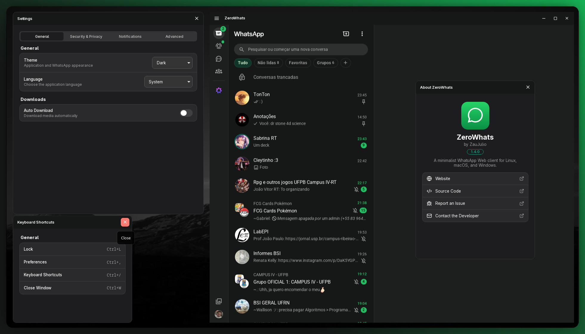
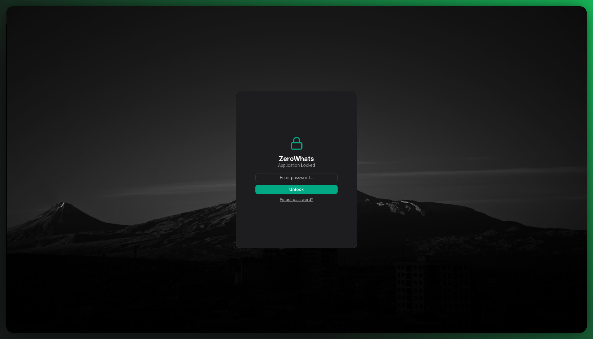
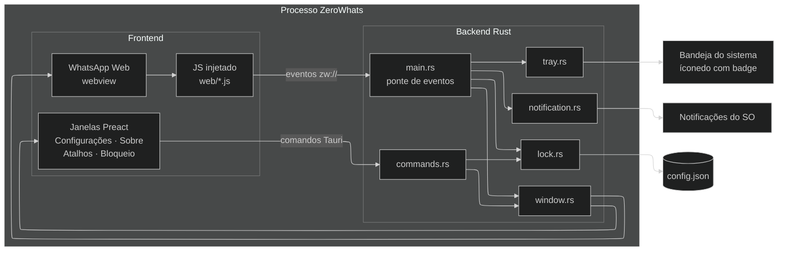
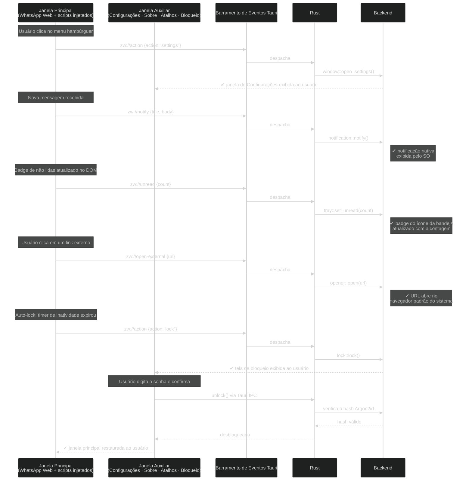

<div align="center">


# ZeroWhats

**Read this in other languages:** [English](README.md)

**Um cliente desktop de WhatsApp Web focado em privacidade, para Linux, macOS e Windows.**

Pequeno, rápido, nativo — construído com [Tauri](https://tauri.app) + [Preact](https://preactjs.com). Sem Electron,
sem telemetria, sem navegador embutido.

<sub>Notificações nativas · Bloqueio de app com auto-lock · Contador de não lidas na bandeja · Sandbox exclusivo do WhatsApp</sub>

<br />

[](LICENSE)


[](https://github.com/ZauJulio/ZeroWhats/releases)
[](CONTRIBUTING.md)

</div>

<p align="center">
  
  
</p>

---

## Por que ZeroWhats?

O WhatsApp Web em uma janela desktop de verdade, com o que a aba do navegador não
consegue te dar — e nada do que ela não deveria:

- 🔔 **Notificações nativas do sistema.** As notificações web do WhatsApp são
  redirecionadas para o serviço de notificação do sistema. Sem prompts de
  permissão do navegador, e sem poluir as teclas de mídia com uma sessão MPRIS.
- 🔒 **Bloqueio de app.** Senha opcional (Argon2id), com **bloqueio ao fechar**
  e **bloqueio por inatividade** (auto-lock após N minutos). Remover ou trocar
  a senha exige a senha atual, ou autenticação de administrador do sistema
  (polkit no Linux, UAC no Windows, um prompt de admin no macOS) — assim um
  ladrão não consegue simplesmente remover o bloqueio. Esqueceu a senha por
  completo? No Linux você reseta via polkit; nas outras plataformas o
  ZeroWhats oferece deslogar e apagar os dados locais. As Configurações ficam
  inacessíveis enquanto o app está bloqueado.
- 🔢 **Contador de não lidas na bandeja.** O total de mensagens não lidas é
  desenhado como um badge diretamente no ícone da bandeja — visível no
  GNOME/AppIndicator, macOS e Windows.
- 🖱️ **Menu da bandeja.** Mostrar, Preferências, Mutar/Desmutar (o rótulo
  alterna), um separador, depois Bloquear (quando uma senha está definida) e
  Sair. Ícones por item aparecem no KDE/macOS/Windows; a ponte AppIndicator do
  GNOME não suporta ícones por item de menu, então lá é só rótulos + separador.
- 🛡️ **Sandbox exclusivo do WhatsApp.** A janela do app só navega para o
  WhatsApp; qualquer outro link abre no seu navegador de verdade. A UI local
  roda sob um CSP estrito.
- 🎨 **Tema claro / escuro / do sistema**, tanto para o chrome do app quanto
  para o WhatsApp.
- ✍️ **Verificação ortográfica.** Ative e escolha seus dicionários (inglês,
  português, espanhol, francês, alemão, italiano…) em Configurações →
  Avançado. Palavras com erro são sublinhadas na caixa de mensagem. No Linux
  isso usa os dicionários hunspell/enchant do sistema — instale os que precisar
  (veja [Dicionários de verificação ortográfica](#dicionários-de-verificação-ortográfica) abaixo).
  No macOS e Windows, o corretor ortográfico do SO é usado automaticamente.
- 📋 **Colar da área de transferência que realmente funciona.** Cole
  screenshots *e* arquivos ou imagens copiados do seu gerenciador de arquivos
  direto em uma conversa — uma solução para uma limitação antiga do WebKitGTK
  no Linux.
- 🖼️ **Figurinhas e emojis renderizam corretamente** no Linux, anunciando um
  user-agent real do WebKit (Safari), para que o WhatsApp sirva o caminho de
  código testado para WebKit.
- 🪟 **Janela sem bordas personalizada** com uma barra de título embutida na
  página: botão de maximizar, duplo clique para maximizar, e alças de
  redimensionamento nas bordas/cantos.
- 🪶 **Pequeno e rápido.** Um binário Rust otimizado para tamanho e a WebView
  do sistema — uma fração do tamanho de um app Electron.

## Instalação

Pegue o arquivo para sua plataforma na [última release](https://github.com/ZauJulio/ZeroWhats/releases):

| SO          | Arquivo                                | Notas                                                              |
| ----------- | --------------------------------------- | ------------------------------------------------------------------ |
| **Linux**   | `.AppImage`                             | Portátil — dê `chmod +x` e execute.                                |
| **Linux**   | `.deb` / `.rpm`                         | `sudo apt install ./ZeroWhats_*.deb` / `sudo dnf install ./*.rpm` |
| **Linux**   | Snap / AUR (`zerowhats-bin`)            | Veja [`release/`](release/).                                       |
| **Windows** | `.msi` / `-setup.exe`                   | Usa o WebView2 embutido.                                            |
| **macOS**   | `.dmg`                                  | Builds universais para Apple Silicon e Intel.                      |

> **Nota Linux:** como todo app Tauri, o ZeroWhats usa o **WebKitGTK** do
> sistema (`libwebkit2gtk-4.1`) e uma bandeja AppIndicator. Os pacotes
> `.deb`/`.rpm` declaram isso como dependência; o `.AppImage` empacota a
> maior parte. Um binário estático "sem dependências" não é possível no Linux
> porque a WebView é uma biblioteca do sistema — e é exatamente por isso que o
> binário permanece tão pequeno. Windows (WebView2) e macOS (WKWebView)
> distribuem a WebView junto com o sistema operacional.

## Onde estão meus dados?

| O quê                                                       | Linux                                     | macOS                                                    | Windows                                   |
| ------------------------------------------------------------ | ------------------------------------------ | --------------------------------------------------------- | ------------------------------------------ |
| **Configurações** (`config.json`)                            | `~/.config/com.zaujulio.zerowhats/`       | `~/Library/Application Support/com.zaujulio.zerowhats/` | `%APPDATA%\com.zaujulio.zerowhats\`       |
| **Sessão do WhatsApp** (cookies, IndexedDB, service worker) | `~/.local/share/com.zaujulio.zerowhats/` | `~/Library/Application Support/com.zaujulio.zerowhats/` | `%LOCALAPPDATA%\com.zaujulio.zerowhats\` |

`config.json` guarda suas preferências e o **hash** Argon2id da senha (nunca a
senha em si). Apagar a pasta de dados reseta o app por completo e desloga o
WhatsApp — exatamente o que o fluxo de "esqueci a senha" faz por você nas
plataformas fora do Linux.

## Desenvolvimento

Requer [bun](https://bun.sh), a [toolchain do Rust](https://rustup.rs), e os
[pré-requisitos do Tauri](https://v2.tauri.app/start/prerequisites/) para o seu SO.

```bash
bun install
bun run tauri dev      # roda com hot-reload
bun run tauri build    # gera instaladores otimizados para o SO atual
```

Usuários do VS Code já têm `Run > Debug ZeroWhats` (LLDB) configurado via `.vscode/`.

## Arquitetura

Uma janela sem bordas carrega o **WhatsApp Web**; um conjunto de arquivos
JavaScript é injetado na página para adicionar a barra de título, interceptar
notificações, e conectar eventos de volta ao Rust. As telas de Configurações /
Sobre / Atalhos / Bloqueio são janelas **Preact** separadas e sem bordas que se
comunicam com o backend por comandos Tauri tipados.

```text
ZeroWhats/
├─ src/                         # frontend Preact (janelas secundárias sem bordas)
│  ├─ lib/                      #   camadas não-UI
│  │  ├─ api.ts                 #     bindings tipados dos comandos Tauri (IPC)
│  │  ├─ theme.ts               #     chrome de janela claro/escuro
│  │  ├─ window.ts              #     revela quando pronto (sem flash de abertura)
│  │  ├─ translations/          #     strings de locale en / pt-BR
│  │  └─ cx.ts                  #     helper de junção de className
│  ├─ ui/
│  │  └─ components/            #     AppWindow, Group, Row, Toggle, Select
│  ├─ screens/                  #   um diretório por label de janela
│  │  ├─ Settings/              #     index.tsx + Settings.module.css
│  │  ├─ About/                 #     index.tsx + About.module.css
│  │  ├─ Shortcuts/             #     index.tsx + Shortcuts.module.css
│  │  └─ Lock/                  #     index.tsx + Lock.module.css
│  ├─ App.tsx                   #   roteia uma tela pelo label da janela
│  └─ styles.css                #   tokens globais, variáveis de tema, resets
├─ src-tauri/
│  ├─ src/                      # backend Rust — um módulo por responsabilidade
│  │  ├─ main.rs                #     bootstrap + ponte de eventos web→Rust
│  │  ├─ window.rs              #     janelas + guarda de navegação exclusiva do WhatsApp
│  │  ├─ lock.rs                #     estado de bloqueio, desbloqueio, auto-lock
│  │  ├─ notification.rs        #     notificações nativas + mudo
│  │  ├─ tray.rs                #     bandeja do sistema + renderizador do badge de não lidas
│  │  ├─ commands.rs            #     camada fina de IPC #[command] (janelas locais)
│  │  ├─ config.rs              #     modelo de configuração + DTOs
│  │  ├─ password.rs            #     hashing Argon2id + reset via polkit
│  │  ├─ scripts.rs             #     carrega web/*.js via include_str!
│  │  └─ web/                   #     scripts injetados na página do WhatsApp
│  │     ├─ bootstrap.js        #       inicialização + ponte da API tauri
│  │     ├─ titlebar.js         #       menu hambúrguer → eventos zw://action
│  │     ├─ notifications.js    #       intercepta Notification → zw://notify
│  │     ├─ unread-badge.js     #       contagem do badge no DOM → zw://unread
│  │     ├─ links.js            #       links externos → zw://open-external
│  │     ├─ auto-lock.js        #       timer de inatividade → zw://action{lock}
│  │     ├─ rounded-corners.js  #       estilo de cantos da janela sem bordas
│  │     ├─ fullscreen.js       #       alternância de tela cheia
│  │     ├─ find.js             #       busca de texto na página
│  │     ├─ background-sync.js  #       keepalive de sincronização em segundo plano
│  │     └─ wipe-session.js     #       limpeza de sessão sob demanda
│  ├─ capabilities/             # ACL do Tauri (permissões de origem remota)
│  ├─ icons/                    # ícones do app (gerados a partir de ../icon.svg)
│  └─ tauri.conf.json
├─ release/                     # definições de empacotamento (linux/snap/aur/win/mac)
├─ icon.svg                     # fonte do ícone
└─ .github/workflows/           # CI — release.yml
```

### Arquitetura de componentes



### Fluxo de eventos `zw://`

Os scripts injetados rodam na origem remota `web.whatsapp.com`, que o Tauri
impede de chamar comandos do app diretamente. Eventos são a única ponte.



### Por que eventos, não comandos, a partir da página do WhatsApp

A barra de título vive dentro da página remota `web.whatsapp.com`. O Tauri só
permite que uma origem remota chame comandos **core** — nunca comandos do
app — então os scripts injetados não conseguem usar `invoke()` nos nossos.
Em vez disso eles **emitem eventos** (`zw://action`, `zw://unread`,
`zw://notify`), o que é uma capacidade core concedida em
`capabilities/default.json`; o `register_web_events` em `main.rs` escuta e
despacha. (É isso que faz o menu hambúrguer realmente abrir janelas.)

## Dicionários de verificação ortográfica

No **Linux**, a verificação ortográfica usa as bibliotecas hunspell/enchant do
sistema. Instale os pacotes de dicionário para os idiomas que deseja usar:

```bash
# Arch / AUR
sudo pacman -S hunspell-en_us hunspell-pt-br hunspell-es_es hunspell-fr hunspell-de hunspell-it

# Debian / Ubuntu
sudo apt install hunspell-en-us hunspell-pt-br hunspell-es hunspell-fr hunspell-de-de hunspell-it

# Fedora / RHEL
sudo dnf install hunspell-en-US hunspell-pt-BR hunspell-es hunspell-fr hunspell-de hunspell-it
```

Depois ative a verificação ortográfica e selecione seus idiomas em
**Configurações → Avançado**.

No **macOS** e **Windows**, o corretor ortográfico nativo do SO é usado
automaticamente com base nas configurações de idioma do sistema — nenhum
download adicional é necessário.

## Perguntas frequentes

<details>
<summary><strong>Como eu mudo/silencio as notificações?</strong></summary>

Use o menu da bandeja — é um único alternador que troca entre "Mutar" e
"Desmutar". Mutar suprime totalmente as notificações (sem título, sem corpo,
nada é exibido); não é apenas um modo "silencioso".

</details>

<details>
<summary><strong>Ctrl+W não fecha o app enquanto está bloqueado — isso é um bug?</strong></summary>

Não, é intencional. Na tela de bloqueio, Ctrl+W esconde a janela na bandeja
(o mesmo que fechar a janela principal) em vez de fechar/desbloquear — o app
continua bloqueado de qualquer forma. Só é acessível novamente pela bandeja.

</details>

<details>
<summary><strong>O ZeroWhats tem acesso às minhas mensagens?</strong></summary>

Não. O ZeroWhats é uma casca fina em volta do WhatsApp Web — ele não armazena
conteúdo de mensagens e não envia telemetria. Todos os dados vivem nos
servidores do WhatsApp e no armazenamento local da WebView (cookies,
IndexedDB) que o próprio WhatsApp escreve. O backend em Rust nunca lê esses
dados.

</details>

<details>
<summary><strong>Por que ele precisa de polkit / privilégios de admin no Linux?</strong></summary>

Não precisa, para o uso normal. O polkit só é chamado quando você esquece a
senha do bloqueio do app e escolhe resetá-la. Nesse fluxo, o polkit confirma
sua identidade no sistema para que o ZeroWhats saiba que é seguro apagar o
hash da senha armazenada.

</details>

<details>
<summary><strong>Por que WebKitGTK em vez de um motor de navegador embutido?</strong></summary>

Usar a WebView do sistema mantém o binário pequeno (sem Chromium embutido),
permite que o ZeroWhats se beneficie das atualizações de segurança do
sistema operacional, e segue como todo app nativo GNOME/KDE relacionado à web
funciona. O trade-off é que as versões do WebKitGTK variam entre distros —
veja [CONTRIBUTING.md](CONTRIBUTING.md) para os pacotes de sistema necessários.

</details>

<details>
<summary><strong>A janela fica em branco ou branca na minha configuração Linux. O que eu faço?</strong></summary>

Isso é tipicamente um problema do renderizador DMABUF do WebKitGTK em
configurações NVIDIA + Wayland. Inicie com `ZW_FORCE_SOFTWARE=1` definido no
seu ambiente. Se isso resolver, defina a variável permanentemente no seu
perfil do shell ou entrada de área de trabalho.

</details>

<details>
<summary><strong>Posso usar o ZeroWhats atrás de um proxy corporativo?</strong></summary>

Sim — abra Configurações → Geral e informe a URL do seu proxy HTTP/HTTPS. O
ZeroWhats define `http_proxy` / `https_proxy` para o processo WebKit antes
dele iniciar, então todo o tráfego passa pelo proxy. A configuração tem
efeito na próxima inicialização.

</details>

<details>
<summary><strong>Como a senha do bloqueio do app é armazenada?</strong></summary>

Apenas como um **hash** Argon2id — a senha real nunca é salva. O hash vive em
`config.json`, no diretório de configuração do app do SO (veja *Onde estão
meus dados?* acima). Qualquer um com acesso de leitura a esse arquivo pode
atacar o hash offline, então o bloqueio é projetado para dissuadir acesso
casual, não atacantes locais determinados. Veja [SECURITY.md](SECURITY.md)
para o modelo de ameaça completo.

</details>

## Contribuindo

Pull requests e issues são bem-vindos! Veja [CONTRIBUTING.md](CONTRIBUTING.md)
para instruções de configuração, convenções de código, e o checklist de PR.

## Código de Conduta

Este projeto segue o [Contributor Covenant v2.1](CODE_OF_CONDUCT.md). Ao
participar você concorda em manter esses padrões. Violações podem ser
reportadas para [zaujulio.dev@gmail.com](mailto:zaujulio.dev@gmail.com).

## Contribuidores

<a href="https://github.com/ZauJulio">
  
</a>

Quer ver seu avatar aqui? Abra um PR!

## Releases e empacotamento

`bun run tauri build` gera instaladores para o SO atual. A matriz completa
multiplataforma e as definições de Snap/AUR vivem em
[`release/`](release/), e `.github/workflows/release.yml` constrói e publica
tudo isso a cada push de tag `vX.Y.Z`. Veja [`release/README.md`](release/README.md).

## Licença

[MIT](LICENSE) © ZauJulio. Não afiliado ao WhatsApp ou à Meta.
